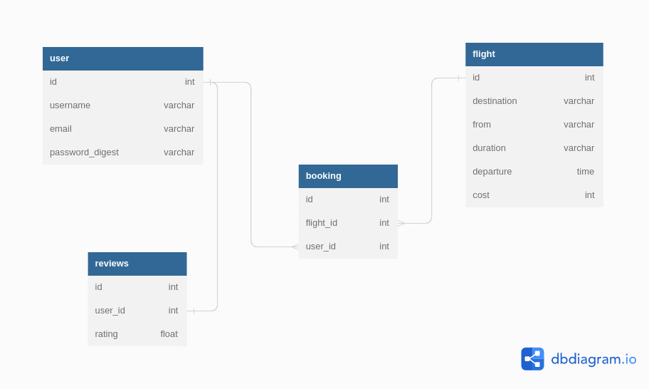

# Safari Flights

Authors: 
- Dan Njuguna
- Leah Wanjiku
- Minneh Waithira
- Mercy Nyambura Kariuki

License: MIT

# About
 
Safari Flights is a regional airline that specializes in providing convenient and affordable air travel services to its customers. With its headquarters located in the heart of the African savannah, Safari Flights offers a unique flying experience that allows passengers to take in the breathtaking scenery from above. 
 
The airline's fleet consists of modern and well-maintained aircraft that are operated by experienced and highly trained pilots. Passengers can expect comfortable seating, ample legroom, and a variety of in-flight amenities to make their journey as pleasant as possible. 
 
Safari Flights is committed to safety and has implemented strict protocols to ensure the well-being of its passengers and crew. Additionally, the airline prides itself on providing excellent customer service and strives to make every interaction with its passengers a positive one. 
 
Whether you're traveling for business or leisure, Safari Flights offers a range of destinations to suit your needs. From bustling cities to remote wilderness areas, the airline provides a convenient and efficient way to explore the diverse landscapes of Africa. With Safari Flights, you can sit back, relax, and enjoy the journey.

<strong>As a user, you should: </strong>
- Sign Up if you don't have an account
- Login and view the flights available
- Book a flight
- View the flights you've booked fr9m your profile

# Deliverables

The API is built using Ruby on Rails

## Setup

To get started with the API
1. Clone the repository to your local machine
2. Run <code>bundle install</code>
3. Run <code>rails db:migrate db:seed </code>
4. Run <code>rails s </code>

The API should be available at <code>http://localhost:3000</code>

To get started with the front-end
1. Run <code>npm install</code>
2. Run <code>npm start --prefix client</code> to start the front-end server
